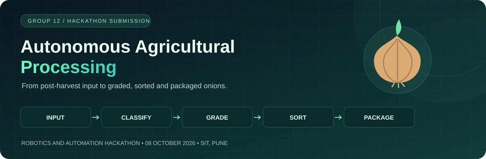
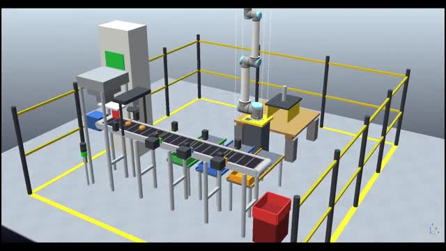
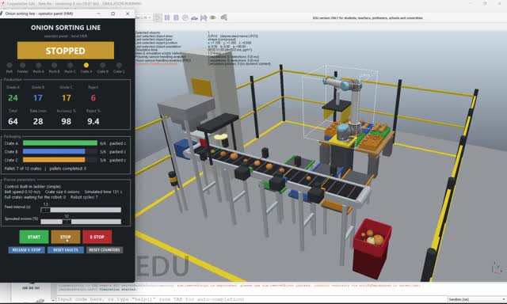
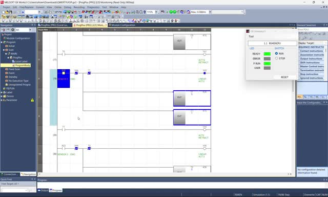
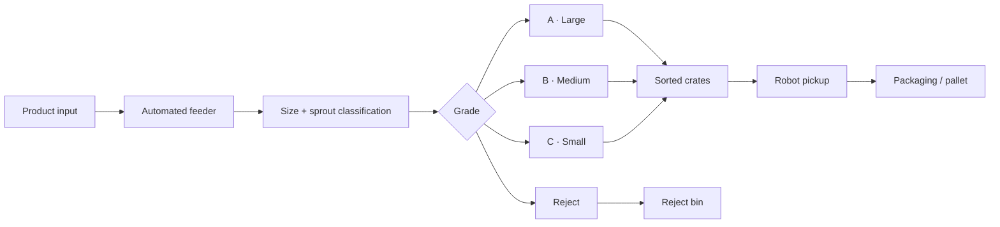
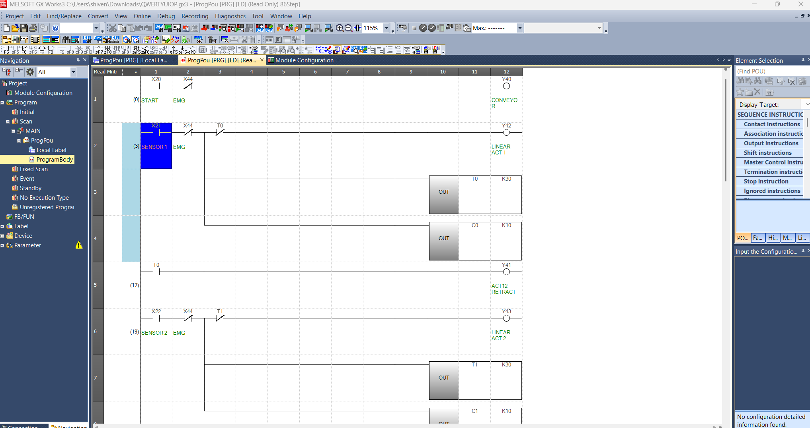
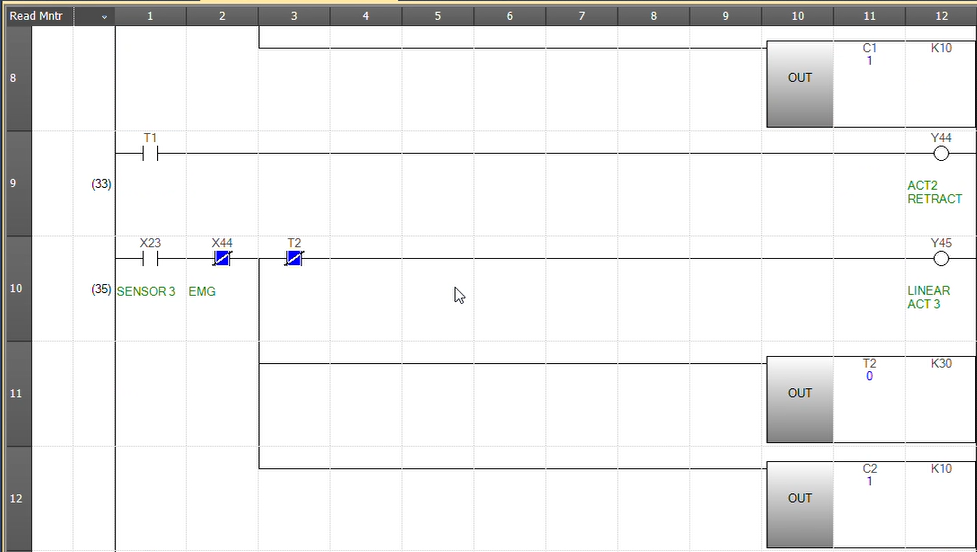
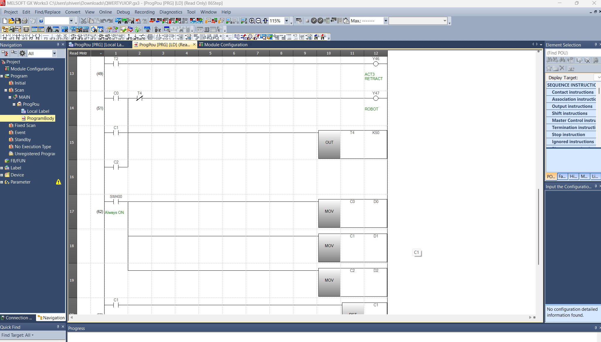

<p align="center">
  
</p>

<h1 align="center">🌱 Autonomous Agricultural Processing</h1>

<p align="center">
  <strong>Classify. Grade. Sort. Package.</strong><br>
  Group 12 · Department of Robotics and Automation · Symbiosis Institute of Technology, Pune
</p>

<p align="center">
  
  
  
  
</p>

<p align="center">
  <a href="#-demo-videos">Demo videos</a> ·
  <a href="#-problem-statement">Problem statement</a> ·
  <a href="#-quick-start">Quick start</a> ·
  <a href="docs/report/Group12_Autonomous_Agricultural_Processing_Report_V7.pdf">Project report</a> ·
  <a href="#-team--group-12">Our team</a>
</p>

---

This project was **our submission for the Robotics and Automation Hackathon held on 8 October 2026 (08/10/26)**.

Our post-harvest onion processing cell brings together automated feeding, size and sprout classification, three sorting grades, rejection handling, quantity monitoring, and robotic crate handling for packaging. The repository includes the Python line model, CoppeliaSim scene, OpenPLC Structured Text, report, screenshots, and three full-length compressed demonstration recordings.

## 🎬 Demo videos

Click a preview to open the full recording. Direct video links are available underneath.

| Project overview | CoppeliaSim simulation | GX Works3 PLC demo |
|:---:|:---:|:---:|
| [](docs/media/project-overview.mp4) | [](docs/media/coppeliasim-demo.mp4) | [](docs/media/gxworks3-demo.mp4) |
| **1 min 43 sec** · Processing cell overview | **1 min 24 sec** · 3D scene and operator panel | **1 min 8 sec** · Ladder logic demonstration |
| [Open video](https://github.com/anksax/Autonomous-Agricultural-Processing/raw/refs/heads/main/docs/media/project-overview.mp4) | [Open video](https://github.com/anksax/Autonomous-Agricultural-Processing/raw/refs/heads/main/docs/media/coppeliasim-demo.mp4) | [Open video](https://github.com/anksax/Autonomous-Agricultural-Processing/raw/refs/heads/main/docs/media/gxworks3-demo.mp4) |

The videos retain the original runtime and audio tracks, with compression for convenient viewing and downloading. See [recording details](docs/demos.md).

## 🎯 Problem statement

**Group 12 – Autonomous Agricultural Processing**

Design a post-harvest processing system that receives agricultural products, classifies them according to size/quality, sorts them and prepares them for packaging.

### Minimum features

| Requirement | Project approach |
|---|---|
| Minimum 3 grades/categories | Grade A, B and C, with a separate reject category |
| Automated feeding | Timed feeder releases onions onto the conveyor |
| Classification decision | Diameter thresholds and simulated sprout inspection |
| Sorting | Three pushers divert onions into grade-specific crates |
| Packaging | Full-crate handling and robotic palletizing in the line model |
| Fault/rejection handling | Reject routing, emergency stop and control-mode fault logic |
| Quantity monitoring | Grade-wise counts, rejected quantity and processing KPIs |

### Expected flow

**Product Input → Classification → Grading → Sorting → Packaging**



### Grading rules

| Category | Diameter / quality rule |
|:---|:---|
| 🟢 **Grade A** | 70 mm to below 90 mm |
| 🔵 **Grade B** | 55 mm to below 70 mm |
| 🟡 **Grade C** | 40 mm to below 55 mm |
| 🔴 **Reject** | Sprouted, below 40 mm, or 90 mm and above |

### Suggested KPIs

- **Classification accuracy** — correct classifications against reference grades.
- **Processing rate** — onions processed per minute.
- **Grade-wise quantity** — counts for A, B, C, and rejects.

## ⚙️ Technology and control modes

| Tool / technology | Role |
|---|---|
| **Python** | Plant model, built-in PLC interpreter, dashboard and operator panel |
| **CoppeliaSim** | 3D conveyor, grading stations, crates and robot scene |
| **OpenPLC / Structured Text** | Optional external controller |
| **OPC UA** | Sensor, command and KPI exchange with the external controller |
| **Mitsubishi GX Works3** | Separate ladder logic implementation shown in the supplied evidence |
| **RT ToolBox** | Robot program and taught-position evidence |

`agricultural-automation` · `robotics` · `post-harvest-processing` · `onion-sorting` · `plc` · `openplc` · `coppeliasim` · `opc-ua` · `python` · `hackathon`

## 🚀 Quick start

### Run the offline simulation

No CoppeliaSim or OpenPLC installation is needed for this mode.

```bash
python src/onion_sorting_line.py --offline --duration 120 --no-dashboard --no-hmi --seed 1
```

For the local dashboard and operator panel:

```bash
python src/onion_sorting_line.py --offline --duration 120
```

The offline check was performed with **Python 3.14 on Windows**. The operator window requires tkinter.

<details>
<summary><strong>Run the CoppeliaSim 3D cell</strong></summary>

Start CoppeliaSim and open a **new empty scene**. The source documents CoppeliaSim 4.6 or newer.

```bash
python -m pip install -r requirements.txt
python src/onion_sorting_line.py --check
python src/onion_sorting_line.py
```

The builder removes existing objects by default. Use an empty scene or the `--keep-scene` option. The supplied saved scene is [simulation/onion_sim.ttt](simulation/onion_sim.ttt); equivalence to the current generated scene has not been verified.

</details>

<details>
<summary><strong>Connect OpenPLC through OPC UA</strong></summary>

```bash
python -m pip install -r requirements-opcua.txt
python src/onion_sorting_line.py --opc-check
python src/onion_sorting_line.py --plc opcua
```

Follow the [setup guide](docs/setup.md) for variable declarations, endpoint configuration and the 42-tag I/O map. Credentials should remain outside the repository.

</details>

## 📊 Reproduced offline result

A **120-second simulation**, using seed 1 and the simple 53-rung ladder, completed successfully during repository preparation.

| Processed | Grade A | Grade B | Grade C | Rejects | Simulated accuracy |
|:---:|:---:|:---:|:---:|:---:|:---:|
| **58** | 23 | 14 | 15 | 6 | **98%** |

The final 60-second rate indicator was **28 onions/minute**. These are results from one simulated run; accuracy uses the model's reference grades. See [validation details](docs/validation.md) for conditions and remaining checks.

## 📁 Repository guide

```text
Autonomous-Agricultural-Processing/
├── src/                     Python simulation and control logic
├── plc/openplc/             Structured Text, variables and I/O map
├── simulation/              CoppeliaSim scene
├── docs/
│   ├── media/               Demo videos, previews and banner
│   ├── screenshots/         OpenPLC, GX Works3 and RT ToolBox
│   ├── report/              Project report PDF
│   ├── setup.md             Installation and operating modes
│   ├── validation.md        Reproduced results and verification scope
│   └── demos.md             Recording details
├── requirements.txt         CoppeliaSim dependency
└── requirements-opcua.txt   Optional OPC UA dependencies
```

## 👥 Team — Group 12

**Department of Robotics and Automation**  
**Symbiosis Institute of Technology, Pune**

| Team member | PRN |
|---|---|
| **Ankur Saxena** | `24070127019` |
| **Apara Shaligram** | `24070127023` |
| **Sakshi Goyal** | `24070127101` |
| **Yajat Alimchandani** | `24070127137` |
| **Om Sonawane** | `25070127510` |
| **Raghavendra Pathe** | `25070127508` |

Team details are recorded in the [project report](docs/report/Group12_Autonomous_Agricultural_Processing_Report_V7.pdf).

## 🖼️ Implementation gallery

<details>
<summary><strong>OpenPLC Structured Text</strong></summary>


</details>

<details>
<summary><strong>GX Works3 ladder logic — rungs 1–19</strong></summary>





</details>

<details>
<summary><strong>RT ToolBox robot program</strong></summary>


</details>

## 📝 Project notes

- Onions, crates and tooling move kinematically; physics is switched off.
- Sprout inspection is probabilistic simulated sensor data, rather than a trained camera model.
- The default crate capacity is **6 onions**. Use `--help` for current options; introductory source comments include some older defaults.
- The GX Works3 and RT ToolBox evidence shows separate implementations. Their connection to the Python simulation has not been independently verified, and native project exports were not supplied.
- This academic simulation has not been validated as an industrial control or safety system.
- No open-source reuse license has been selected. See [license status](LICENSE-NOTICE.md); third-party software and model assets retain their respective terms.

---

<p align="center">
  <strong>Group 12 · Robotics and Automation Hackathon · 8 October 2026</strong><br>
  From agricultural input to automated packaging.
</p>
